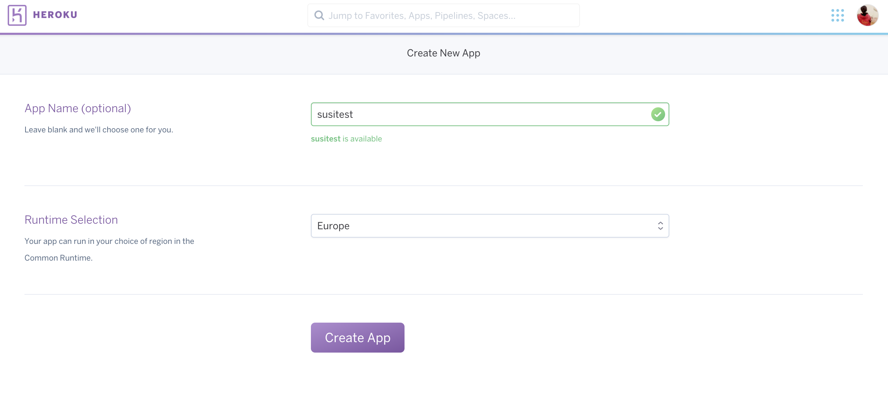
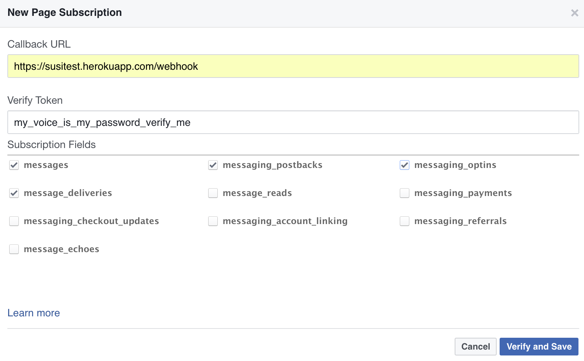

# AskSusi Facebook Messenger Bot

Development [](https://travis-ci.org/fossasia/susi_fbbot)
Master [](https://travis-ci.org/fossasia/susi_fbbot)
[](https://circleci.com/gh/fossasia/susi_fbbot)
[](https://codeclimate.com/github/fossasia/susi_fbbot)
[](https://gitter.im/fossasia/susi_server)

This is the  Facebook messenger bot for [AskSusi](https://github.com/fossasia/susi_server).


[](https://cloud.docker.com/stack/deploy/?repo=https://github.com/fossasia/susi_fbbot) [](https://heroku.com/deploy?template=https://github.com/fossasia/susi_fbbot)

## Technology Stack

```node.js``` and ```Express```.

## Getting Started

It's easy for you to create your own facebook messenger bot and integrate susi's API into it. You can read the  [documentation](https://developers.facebook.com/docs/messenger-platform/quickstart) as prepared by the Messenger team.

Messenger bots uses a web server to process messages it receives or to figure out what messages to send. You also need to have the bot be authenticated to speak with the web server and the bot approved by Facebook to speak with the public.

### Setup your own Messenger Bot
1. Fork this repository.

2. Create a facebook page [here](https://www.facebook.com/pages/create/).

 

 

3. Create a new [Google Cloud](docs/installations/gce-kubernetes.md) or [Heroku App](https://dashboard.heroku.com/new?org=personal-apps).

 

4. Connect the heroku app to the forked repository.

 

5. Deploy on development branch. If you intend to contribute, it is recommended to Enable Automatic Deploys.

 

 

6. Create or configure a Facebook App or Page [here](https://developers.facebook.com/apps/)

 

7. Get started with Messenger tab in the created app.

 

8. In the Page Access Token select the fb page that you created and generate the token and save it somewhere for future use.

 

9. Now, go to the heroku app, select the settings tab and add the environment variable as shown, where key is FB_PAGE_ACCESS_TOKEN and value is the token generated in the previous step.

 

10. Create a webhook on the facebook app dashboard. The Callback url should be https://&lt;your_app_name&gt;.herokuapp.com/webhook/ and rest should be as shown in the image below.

 

 

11. Go to Terminal and type in this command to trigger the Facebook app to send messages. Remember to use the token you requested earlier.
  ```
  curl -X POST "https://graph.facebook.com/v2.6/me/subscribed_apps?access_token=<PAGE_ACCESS_TOKEN>"
  ```

12. Go to the facebook page created and locate 'Message Now' or go to https://m.me/PAGE_USERNAME

 

13. Enjoy chatting with Susi.

 


## Branch Policy

The default branch is ```development```, so make sure you contribute only on this branch.

## License

This project is licensed under the GNU GENERAL PUBLIC LICENSE, Version 3. Please find more info in our [license document](LICENSE.md).
